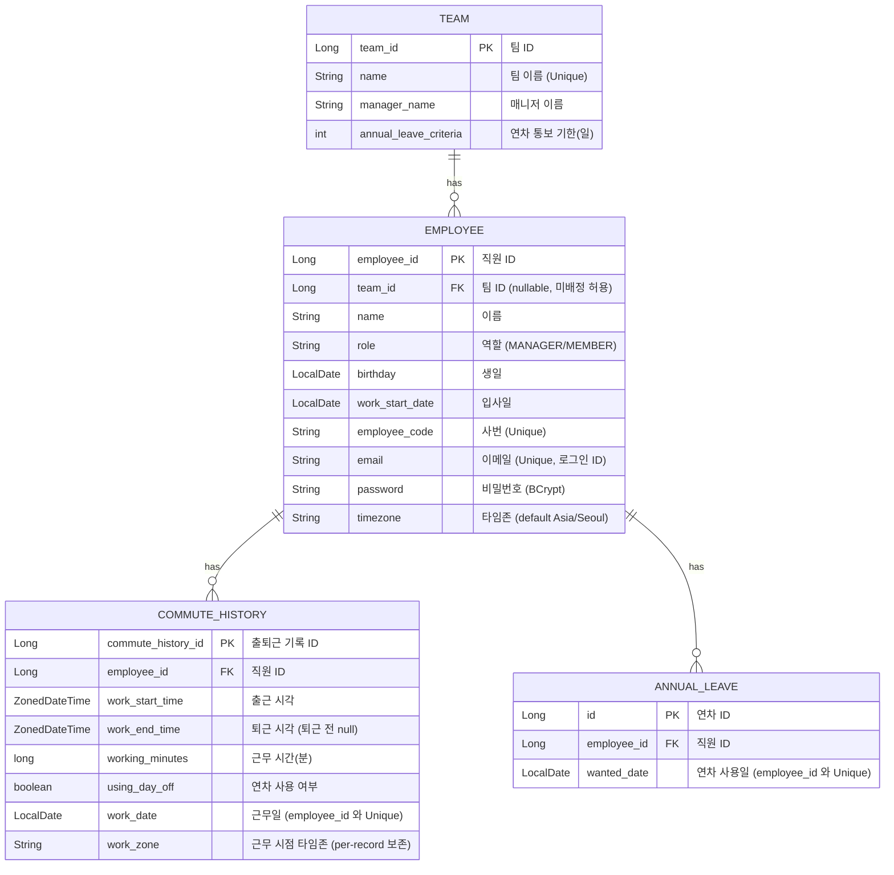

# office-commute

## API 명세 확인하기

API 명세는 저장소 루트의 `openapi.yml` 이 단일 소스(Spec-first)입니다. 컨트롤러/DTO를 바꾸면 `openapi.yml` 도 함께 갱신하며, 컨트롤러에는 `@Operation`·`@ApiResponse` 같은 어노테이션을 붙이지 않습니다.

```bash
# 명세 문법/구조 검증
./gradlew openApiValidate

# check 태스크에 묶여 있어 빌드 시 자동으로 함께 검증됨
./gradlew check
```

명세를 시각화해서 보고 싶다면 `openapi.yml` 내용을 Swagger Editor에 붙여 넣거나 VS Code의 OpenAPI 확장을 사용하세요.

> 현재는 코드 생성을 사용하지 않습니다 (`build.gradle` 의 OpenAPI 블록 주석 참고). 외부 클라이언트가 생기는 시점에 `openApiGenerate` 를 켤 예정이며, 그전까지는 컨트롤러·DTO 와 `openapi.yml` 의 정합을 사람이 책임집니다.

---

## 로컬 MySQL로 실행하기

운영 DB 계열과 동일하게 검증하려면 로컬에서도 MySQL 프로필을 사용할 수 있습니다.

```bash
# Docker Compose 플러그인이 있으면
docker compose up -d

# Compose 플러그인이 없으면
docker run -d \
  --name office-commute-mysql \
  -e MYSQL_DATABASE=office_commute \
  -e MYSQL_USER=office_user \
  -e MYSQL_PASSWORD=office_password \
  -e MYSQL_ROOT_PASSWORD=root_password \
  -p 3306:3306 \
  mysql:8.0

# 환경 파일 준비 (DB_URL / DB_USERNAME / DB_PASSWORD / PUBLIC_API_SERVICE_KEY)
cp .env.example .env

# MySQL 프로필로 애플리케이션 실행 (둘 중 한 가지)
SPRING_PROFILES_ACTIVE=mysql ./gradlew bootRun
./gradlew bootRun --args='--spring.profiles.active=mysql'
```

- `application-mysql.yml` 은 로컬 MySQL 검증용 프로필입니다 (`docker-compose.yml` 의 컨테이너와 짝).
- 기본 접속 정보는 `office_commute / office_user / office_password` 입니다.
- MySQL 계열 스키마는 Flyway 마이그레이션으로 관리하고, 애플리케이션은 `ddl-auto: validate` 로만 검증합니다 — 적용된 `V*__*.sql` 은 절대 수정하지 마세요.
- **`PUBLIC_API_SERVICE_KEY`** (공공데이터포털 특일 정보 API 키) 가 없으면 초과근무 관련 엔드포인트가 `HOLIDAY_DATA_UNAVAILABLE 503` 으로 실패합니다. 키 발급 후 `.env` 에 넣으세요.

## 개요
`사내 출퇴근 관리 시스템` 으로, flex 류 HR 플랫폼을 **실서비스 품질**로 구현하는 것을 목표로 합니다. 시간·날짜·돈처럼 경계가 까다로운 데이터를 다루며, 시간대(timezone) 정합성, 동시성, 외부 API 의존, 명세-구현 일치(Spec-first) 같은 운영급 문제를 코드 안에서 해소하는 데 초점을 둡니다.

핵심 설계 원칙은 다음과 같습니다.
- **Spec-first**: `openapi.yml` 이 API 의 단일 소스, 빌드 시 `openApiValidate` 로 검증.
- **3-layer validation**: 도메인 팩토리/생성자 + JPA 제약 + Flyway DDL 이 항상 일치.
- **파생이 기본**: 집계(예: 팀 멤버 수)는 저장하지 않고 조회 시 계산해 drift / lost-update 를 회피.
- **시간은 명시적으로**: `LocalDateTime` 을 쓰지 않고 `ZonedDateTime` + `LocalDate`, "지금"은 `Clock` 주입으로 결정성 확보.
- **도메인 예외 1 의미 = 1 클래스**, `GlobalExceptionHandler` 가 HTTP 코드로 변환.

## 기술 스택
- **Language**: Java 21
- **Framework**: Spring Boot 3.5.5 — starters: Data JPA / Web / Validation
- **Database**: MySQL 8.0 (운영·검증), H2 (개발·테스트)
- **Migration**: Flyway (`flyway-core`, `flyway-mysql`) — 운영은 `ddl-auto: validate`, 적용된 `V*__*.sql` 은 절대 수정하지 않습니다.
- **API 명세**: OpenAPI 3 (`openapi.yml`) + `org.openapi.generator` 7.7.0 — 현재는 `openApiValidate` 만 사용 (codegen 미적용)
- **인증·보안**: 세션 기반 인증 + `AuthInterceptor` + `@ManagerOnly`. 비밀번호 해싱은 `spring-security-crypto` 의 BCrypt 만 사용하며, 전체 Spring Security 스택은 포함하지 않습니다.
- **외부 연동**: 공공데이터포털 특일 정보 API(XML) — `RestTemplate` + `jackson-dataformat-xml`
- **리포트**: Apache POI 5.2.4 (`poi`, `poi-ooxml`) — Excel(.xlsx) 스트리밍 생성
- **개발 로깅**: P6Spy 1.9.0 (`p6spy-spring-boot-starter`) — `dev` 프로필에서 SQL 가시화
- **Build**: Gradle (Groovy DSL)
- **Test**: JUnit 5 + Spring Boot Test + AssertJ + Mockito (자세한 규칙은 `.claude/rules/testing.md`)

## 주요 기능
- **직원·팀 관리** (매니저 전용 등록/변경)
  - 팀 등록 및 조회: 팀의 이름, 매니저, 연차 통보 기한을 등록하고, 소속 인원 수는 조회 시점에 파생해 함께 반환합니다.
  - 직원 등록·조회 및 팀 재배정: 이름·역할(MANAGER/MEMBER)·입사일·생일·사번·이메일(로그인 ID)·비밀번호(BCrypt)·타임존을 등록하고, 매니저는 직원의 소속 팀을 변경하거나 미배정 상태로 둘 수 있습니다.
- **출퇴근 및 근무 시간 관리** (로그인한 본인 기준)
  - 출퇴근 시간 기록: 로그인 세션을 기준으로 출근·퇴근 시각을 기록합니다. 같은 날 중복 출근(`DUPLICATE_WORK 409`)과 이전 근무 미종료 상태(`PreviousCommuteNotEnded`)를 도메인에서 검증합니다.
  - 직원 타임존 기준 기록: `work_date` 와 `work_zone` 을 직원의 타임존으로 결정해 저장하므로, 멀티 타임존에서도 월 범위 집계가 흔들리지 않습니다.
  - 월별 근무 시간 조회: 월별 근무 기록을 날짜별로 조회하고, 해당 월의 총 근무 시간을 분 단위로 합산해 제공합니다.
- **연차 관리** (본인 신청)
  - 연차 신청: 하루 단위 다중 일자 신청. 검증을 통과하면 즉시 확정되며, 같은 직원·같은 날짜 중복은 unique 제약으로 차단합니다.
  - 팀별 통보 기한 적용: 팀별 `annualLeaveCriteria` (예: "사용일 7일 전부터 신청 가능") 에 따라 신청 시점 검증.
  - 연차 = 근무 기록 동기화: 연차 확정 시 해당 일자에 `usingDayOff=true` 인 `CommuteHistory` 가 함께 생성되어 월별 집계·리포트와 정합을 유지합니다.
  - 남은 연차 조회: 본인의 미래 사용 예정 연차 **일자 목록** 을 반환합니다.
- **초과 근무 정산 및 리포트** (매니저 전용)
  - 초과 근무 시간 자동 계산: 공휴일과 주말을 제외한 월별 법정 근무 시간을 기준으로 모든 직원의 초과 근무 시간을 분 단위로 산출합니다 (근무 기록이 없는 직원은 0분으로 포함).
  - 공휴일 정보 외부 API 연동: 공공데이터포털 특일 정보 API 를 요청 시점에 호출합니다 (현재 DB 캐시 없음 — 실패 시 `HOLIDAY_DATA_UNAVAILABLE 503` 으로 명시적 재시도 유도).
  - Excel 리포트 다운로드: 직원명·부서명·초과 근무 시간·수당이 담긴 `.xlsx` 를 Apache POI 스트리밍으로 생성·다운로드합니다.

## ERD


> 팀의 "소속 인원 수"는 별도 컬럼으로 저장하지 않고, 조회 시 `employee.team_id` 의 `COUNT` 로 파생합니다 (V3 마이그레이션에서 `team.member_count` 제거 — denormalized counter drift / lost-update race 회피).

## Architecture

```mermaid
graph TD
    subgraph "Client"
        User["👤<br/>User"]
    end

    subgraph "Application Server"
        Interceptor["🔐<br/>AuthInterceptor<br/>(Session + @ManagerOnly)"]
        Controllers["Presentation Layer<br/>(Controllers)"]
        Services["Business Logic Layer<br/>(Services)"]
        Repositories["Data Access Layer<br/>(Repositories)"]
        Excel["📄<br/>OverTimeExcelWriter<br/>(Apache POI · XLSX 스트리밍)"]
    end

    subgraph "External Services"
        ExternalAPI["📅<br/>공공데이터포털<br/>특일 정보 API (XML)"]
    end

    subgraph "Database"
        DB["🗄️<br/>Database<br/>(MySQL / H2)<br/>Flyway 마이그레이션 관리"]
    end

    %% High-Level Flow
    User -- "1. HTTP Request<br/>(JSESSIONID)" --> Interceptor
    Interceptor -- "2. currentEmployeeId / role 주입" --> Controllers
    Controllers -- "3. 호출" --> Services
    Services -- "4. JPA / 커스텀 쿼리" --> Repositories
    Repositories -- "5. SQL" --> DB

    %% External / Output Flow
    Services -- "공휴일 조회 (요청 시점, 캐시 없음)" --> ExternalAPI
    Services -- "초과근무 리포트 생성" --> Excel
    Excel -- "StreamingResponseBody" --> User


    %% Styling (Dark Mode Friendly)
    classDef default fill:#2d333b,stroke:#8b949e,stroke-width:2px,color:#adbac7,border-radius:5px;
    classDef client fill:#0e3820,stroke:#3fb950;
    classDef external fill:#422224,stroke:#ff8585;
    classDef db fill:#17304f,stroke:#6cb6ff;
    classDef interceptor fill:#48321a,stroke:#eac54f;
    
    class User client;
    class ExternalAPI external;
    class DB db;
    class Interceptor interceptor;
    class Excel default;
```

